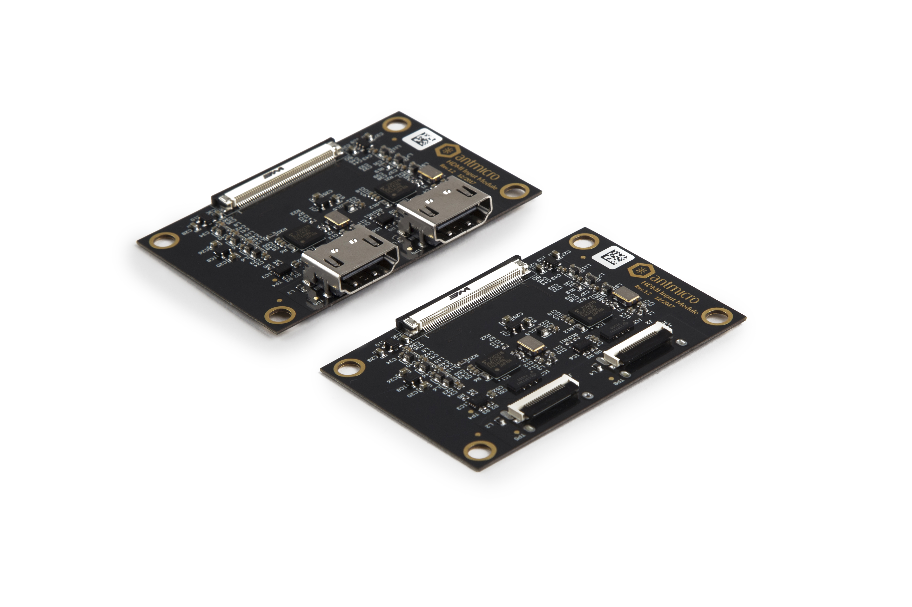

================
HDMI-MIPI Bridge
================

Copyright (c) 2020 `Antmicro <https://www.antmicro.com>`_

Overview
========

This repository contains the open hardware design files for Antmicro's HDMI-MIPI Bridge, which is a video accessory converting HDMI video stream into MIPI CSI-2 counterpart. The conversion is performed using Toshiba `TC358743XBG <https://toshiba.semicon-storage.com/ap-en/semiconductor/product/interface-bridge-ics-for-mobile-peripheral-devices/hdmir-interface-bridge-ics/detail.TC358743XBG.html>`_ HDMI interface bridge.
The board includes two independent conversion channels supporting up to two HDMI streams.

Repository structure:
---------------------

The main repository directory contains the Altium PCB project file, the Outjob file, LICENSE and README.
The remaining files are stored in the following directories:

* ``PCB`` -  contains all Altium design files
* ``Libraries`` - contains component libraries
* ``Documentation`` - contains selected files for device fabrication (schematic in PDF, BoM) generated from the Altium project
* ``Images`` - contains graphics for this README
* ``3DModels`` - contains files defining the mechanical model of the assembled board

Key features
============

* Two independent HDMI-MIPI CSI-2 conversion channels
* Converted MIPI CSI-2 data is exposed on two 4-lane interfaces
* Two assembly variants for regular HDMI and FFC connectors

The PCB project files were prepared in Altium Designer 14.1.

Supported platforms
===================

The board exposes MIPI CSI-2 data on a unified 50-pin FFC connector which is electrically compatible with a variety of processing platforms designed by Antmicro.
Those platforms include: 

* `Jetson Nano / Xavier NX Baseboard <https://github.com/antmicro/jetson-nano-baseboard>`_
* `Google Coral Baseboard <https://github.com/antmicro/google-coral-baseboard>`_
* `Apalis Smart Vision Baseboard <https://github.com/antmicro/apalis-smart-vision-baseboard>`_
* `TX2 Deep Learning Platform <https://github.com/antmicro/jetson-tx2-deep-learning-platform>`_

Please note that some additional work might be required to integrate this board with a particular host platform.
Antmicro’s services involve BSP development so you can hire us to make the necessary modifications.

License
=======

`MIT <LICENSE>`_